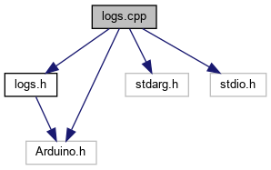

# Log

Biblioteca de logging com códigos de escape de cor ANSI

## Dependencies



> Imagem gerada com [doxygen](https://www.doxygen.nl) usando a ferramenta "dot" do graphviz.

## Ambiente de desenvolvimento
<details>
<summary>Configurando ambiente</summary>
O pré commit é uma forma de verificar o código usando analisadores estáticos,  léxicos e de code standarts evitando bugs e deixando o código mais homogêneo.

Para isso é necessário previamente instalar na máquina os seguintes items:

| Name                          | Location                                                   |Description                                                     |
| ------------------------------|:-----------------------------------------------------------|:---------------------------------------------------------------|
| VSCODE                        |https://code.visualstudio.com/download                      | Ambiente de desenvolvimento é nessário instalar o plugin Platformio                                   |
| Pre-commit                    |https://pre-commit.com/                                     | Git Hook para verificação de código                            |
| Cppcheck                      |https://cppcheck.sourceforge.io/                            | Analisador estático de código                                  |
| Clang-format | https://clang.llvm.org/docs/ClangFormat.html | Formatador de código |
| Cpplint | https://github.com/cpplint/cpplint | Verificador de estilo |

Alternativamente, os itens anteriores podem ser instalados usando os comandos:

```bash
$ pip install pre-commit cpplint
```

```bash
$ sudo apt-get install cppcheck clang-format
```

### Habilitando pre-commit hooks
Para funcionar de forma automática da cada commit verificar o código automaticamente é necessário instalar
o pre-commit no diretório do projeto para isso é necessário executar apenas uma vez o seguinte comando

```
$ pre-commit install
pre-commit installed at .git/hooks/pre-commit
```
***

### Executando verificação manual

```
$ pre-commit run --all
[WARNING] The top-level 'files' field is a regex, not a glob -- matching '/*' probably isn't what you want here
Check for case conflicts.................................................Passed
Check Yaml...............................................................Passed
Fix End of Files.........................................................Passed
Trim Trailing Whitespace.................................................Passed
clang-format.............................................................Passed
cpplint..................................................................Passed
cppcheck.................................................................Passed

```

</details>
